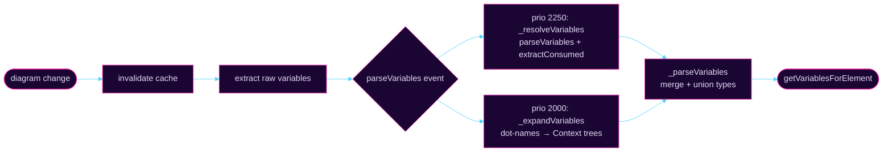

#  Variable Intelligence - what it does & will do

Given a BPMN diagram, answer the question:

> "What variables are **available** at element X, what are their **types**, and what **uses** them?"

<div class="grid grid-cols-4 gap-4 mt-6">

<div class="rounded-xl border border-green-500/40 bg-green-500/10 p-4">

**FEEL editor** ✓

Auto-complete variable names and types while writing FEEL expressions

</div>

<div class="rounded-xl border border-blue-500/40 bg-blue-500/10 p-4">

**Test prefill** ✓ <br> *focus of this talk*

Know which variables a task reads (`usedBy`, `readFrom`) to pre-populate test inputs automatically

</div>

<div class="rounded-xl border border-slate-500/30 bg-slate-500/10 p-4 opacity-50">

**Variables panel** *(future)*

Variable highlighting: which variables are written/read at a given element enabling cross navigation

</div>

<div class="rounded-xl border border-slate-500/30 bg-slate-500/10 p-4 opacity-50">

**Linting** *(future)*

Detect unused variables, type mismatches, missing declarations

</div>

</div>

<div class="mt-6 text-sm opacity-60">

Two flavours: **Camunda 7** (basic, no FEEL resolution) · **Camunda 8 / Zeebe** (full FEEL type-inference pipeline)

</div>

---
layout: default
---

# Structure of this talk

<div class="flex items-center justify-center gap-8 mt-10 text-sm">
<div class="flex flex-col items-center gap-2">
<div class="border border-blue-500/40 bg-blue-500/10 text-blue-300 rounded-lg px-4 py-2 text-center w-48"><div class="text-xs text-blue-400/70 font-mono mb-1">variable-resolver</div><div class="font-semibold">Extract variables</div><div class="text-xs opacity-60 mt-1">raw declarations from BPMN</div></div>
<div class="text-slate-500 text-lg">↓</div>
<div class="border border-blue-500/40 bg-blue-500/10 text-blue-300 rounded-lg px-4 py-2 text-center w-48"><div class="text-xs text-blue-400/70 font-mono mb-1">variable-resolver</div><div class="font-semibold">Find expressions</div><div class="text-xs opacity-60 mt-1">script · input · output</div></div>
<div class="text-slate-500 text-lg">↓</div>
<div class="border border-purple-500/40 bg-purple-500/10 text-purple-300 rounded-lg px-4 py-2 text-center w-48"><div class="text-xs text-purple-400/70 font-mono mb-1">feel-analyzer</div><div class="font-semibold">Parse expressions</div><div class="text-xs opacity-60 mt-1">extract consumed variable names</div></div>
<div class="text-slate-500 text-lg">↓</div>
</div>
<div class="flex flex-col items-center gap-1">
<div class="w-px h-8 bg-slate-600"></div>
<div class="border-2 border-teal-500/60 bg-teal-500/10 text-teal-300 rounded-full px-6 py-4 text-center font-bold"><div>getExpressionDetails</div><div class="text-xs font-normal opacity-70 mt-1">the pivot</div></div>
<div class="w-px h-8 bg-slate-600"></div>
</div>
<div class="flex flex-col items-center gap-2">
<div class="border border-blue-500/40 bg-blue-500/10 text-blue-300 rounded-lg px-4 py-2 text-center w-48"><div class="text-xs text-blue-400/70 font-mono mb-1">variable-resolver</div><div class="font-semibold">Merge & annotate</div><div class="text-xs opacity-60 mt-1">usedBy · readFrom · type unions</div></div>
<div class="text-slate-500 text-lg">↑</div>
<div class="border border-blue-500/40 bg-blue-500/10 text-blue-300 rounded-lg px-4 py-2 text-center w-48"><div class="text-xs text-blue-400/70 font-mono mb-1">variable-resolver</div><div class="font-semibold">Resolve types</div><div class="text-xs opacity-60 mt-1">topological sort · lezer-feel eval</div></div>
<div class="text-slate-500 text-lg">↑</div>
<div class="border border-purple-500/40 bg-purple-500/10 text-purple-300 rounded-lg px-4 py-2 text-center w-48"><div class="text-xs text-purple-400/70 font-mono mb-1">feel-analyzer</div><div class="font-semibold">Infer types</div><div class="text-xs opacity-60 mt-1">Context · List · Number · String…</div></div>
<div class="text-slate-500 text-lg">↑</div>
</div>
</div>

---
layout: default
---

# variable-resolver layout

<div class="absolute top-0 right-0 text-xs font-mono px-2 py-1 rounded-bl border border-t-0 border-r-0 border-blue-500/40 bg-blue-500/10 text-blue-400/80">variable-resolver</div>

``` {18}
lib/
  index.js                     ← bpmn-js DI module registrations
  VariableProvider.js          ← base class for external providers
  base/
    VariableResolver.js        ← BaseVariableResolver: caching, merging, event bus
    util/
      CachedValue.js           ← simple lazy-async cache
      elementsUtil.js          ← getParents()
      ExtensionElementsUtil.js ← getExtensionElementsList(), getInputOutput()
      listUtil.js              ← mergeList()  (used for type union strings)
  camunda/
    VariableResolver.js        ← C7: wraps extract-process-variables/camunda, no FEEL
  zeebe/
    VariableResolver.js        ← C8: plugs FEEL resolution into the event pipeline
    extractors/
      connectors.js            ← ConnectorVariableProvider
    util/
      feelUtility.js           ← ALL the FEEL logic
      VariableContext.js       ← EntriesContext (custom lezer-feel context)
```

---
layout: default
---

# `ProcessVariable`

<div class="absolute top-0 right-0 text-xs font-mono px-2 py-1 rounded-bl border border-t-0 border-r-0 border-blue-500/40 bg-blue-500/10 text-blue-400/80">variable-resolver</div>

````md magic-move
```ts {all|5,6}
type ProcessVariable = {
  name:      string
  type?:     string            // 'String' | 'Number' | 'Boolean' | 'Context' | 'Any' | 'Null' | 'Null|Number' (union)
  info?:     string            // tooltip: raw FEEL expr or atom value
  scope?:    ModdleElement     // element whose scope owns this variable
  origin:    ModdleElement[]   // elements that write/declare this variable
  provider:  Function[]        // extractor functions that produced it
  entries?:  ProcessVariable[] // nested properties when type === 'Context'
}
```

```ts {9,10|all}
type ProcessVariable = {
  name:      string
  type?:     string            // 'String' | 'Number' | 'Boolean' | 'Context' | 'Any' | 'Null' | 'Null|Number' (union)
  info?:     string            // tooltip: raw FEEL expr or atom value
  scope?:    ModdleElement     // element whose scope owns this variable
  origin:    ModdleElement[]   // elements that write/declare this variable
  provider:  Function[]        // extractor functions that produced it
  entries?:  ProcessVariable[] // nested properties when type === 'Context'
  usedBy?:   (string | ModdleElement)[]  // consumers
  readFrom?: string[]          // 'input-mapping' | 'output-mapping' | 'script' | …
}
```
````

<div class="mt-4 p-3 rounded-lg bg-amber-500/10 border border-amber-500/30 text-sm">

⚠️ **`scope` ≠ `origin`** — A sub-process *scopes* a local variable; the *task inside* it is the `origin`.
A variable can have multiple origins, but exactly one scope.

</div>


<div class="grid grid-cols-2 gap-3 mt-3 text-sm">

<div class="p-3 rounded-lg bg-blue-500/10 border border-blue-500/30">

**`usedBy`** — which elements consume this variable

Populated by `feel-analyzer` scanning each expression. <br> If task `T` has  `= order.amount`, then `order.usedBy = [T]`.

→ Key for **test prefill**: given a task, find all variables where `usedBy` contains it.

</div>

<div class="p-3 rounded-lg bg-teal-500/10 border border-teal-500/30">

**`readFrom`** — *how* it is consumed

Used to determine hierarchy of consumption. 

→ Key for **test prefill**: if it contains `output-mapping` its ignored for prefill

</div>

</div>

---
layout: default
---

# variable-resolver -- pipeline refresher

<div class="absolute top-0 right-0 text-xs font-mono px-2 py-1 rounded-bl border border-t-0 border-r-0 border-blue-500/40 bg-blue-500/10 text-blue-400/80">variable-resolver</div>



<div class="grid grid-cols-2 gap-4 mt-4 text-sm">

<div>

**Cache invalidation triggers**
- `commandStack.changed` — any edit
- `diagram.clear` / `import.done`
- `variables.changed` (manual)

</div>

<div>

**Event bus priority order**
- `2250` — FEEL resolve + consumed extraction
- `2000` — hierarchical name expansion
- `base` — merge duplicates, union types

</div>

</div>
